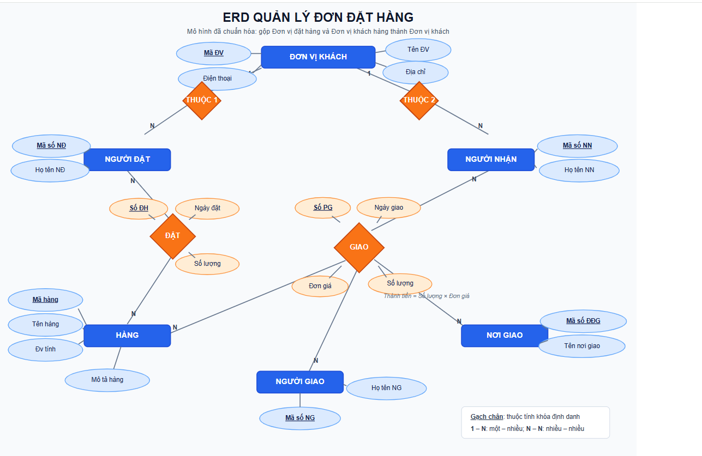

# Bài thực hành: Xây dựng mô hình ERD quản lý đơn đặt hàng

## Mục tiêu

Xây dựng sơ đồ ERD cho bài toán quản lý đơn đặt hàng và phiếu giao hàng.

## 1. Liệt kê, chọn lọc thông tin

- **Đơn đặt hàng:** Số đơn hàng, tên đơn vị đặt hàng, địa chỉ, điện thoại, ngày đặt, tên hàng, mô tả hàng, đơn vị tính, số lượng và họ tên người đặt.
- **Phiếu giao hàng:** Số phiếu giao hàng, tên đơn vị khách hàng, địa chỉ, nơi giao hàng, ngày giao, tên hàng, đơn vị tính, số lượng, đơn giá, thành tiền, họ tên người nhận và họ tên người giao.

## 2. Xác định thực thể và thuộc tính

| Thực thể | Thuộc tính |
| --- | --- |
| ĐƠN VỊ ĐẶT HÀNG | Mã ĐV (PK), Tên ĐV, Địa chỉ, Điện thoại |
| ĐƠN VỊ KHÁCH HÀNG | Mã ĐV (PK), Tên ĐV, Địa chỉ |
| HÀNG | Mã hàng (PK), Tên hàng, Đơn vị tính, Mô tả hàng |
| NGƯỜI ĐẶT | Mã số NĐ (PK), Họ tên NĐ |
| NGƯỜI NHẬN | Mã số NN (PK), Họ tên NN |
| NƠI GIAO | Mã số ĐĐG (PK), Tên nơi giao |
| NGƯỜI GIAO | Mã số NG (PK), Họ tên NG |

## 3. Xác định các mối quan hệ

- NGƯỜI ĐẶT **thuộc** ĐƠN VỊ ĐẶT HÀNG.
- NGƯỜI NHẬN **thuộc** ĐƠN VỊ KHÁCH HÀNG.
- NGƯỜI ĐẶT **đặt** HÀNG. Quan hệ **ĐẶT** có các thuộc tính: Số ĐH, Ngày đặt, Số lượng.
- NGƯỜI GIAO **giao** HÀNG cho NGƯỜI NHẬN tại NƠI GIAO. Quan hệ **GIAO** có các thuộc tính: Số PG, Ngày giao, Số lượng, Đơn giá; Thành tiền = Số lượng × Đơn giá.

## 4. Chuẩn hóa, rút gọn mô hình ERD

ĐƠN VỊ ĐẶT HÀNG và ĐƠN VỊ KHÁCH HÀNG đều là đơn vị bên ngoài giao dịch với cửa hàng, nên được gộp thành thực thể **ĐƠN VỊ KHÁCH** gồm: Mã ĐV (PK), Tên ĐV, Địa chỉ và Điện thoại.

Sau khi chuẩn hóa, NGƯỜI ĐẶT và NGƯỜI NHẬN đều liên kết với thực thể ĐƠN VỊ KHÁCH. Thành tiền là thuộc tính dẫn xuất, được tính từ Số lượng × Đơn giá.

## 5. Sơ đồ ERD hoàn chỉnh

